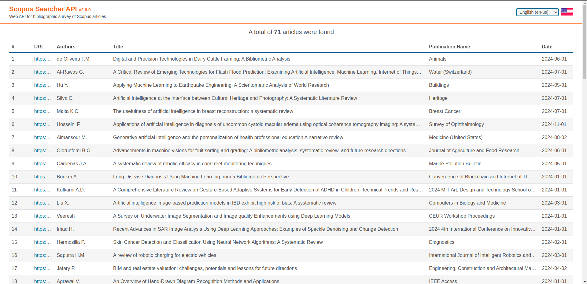

# Scopus Survey API

<p align="center">
  
</p>
<p align="center">
  <em>Web API for bibliographic survey of Scopus articles</em>
</p>
<p align="center">
  <a href="https://github.com/mauprogramador/scopus-survey-api/actions/workflows/verification.yml" target="_blank" rel="external" title="Lint & Test">
    
  </a>
  <a href="https://github.com/mauprogramador/scopus-survey-api/actions/workflows/documentation.yml" target="_blank" rel="external" title="Documentation">
    
  </a>
  
  <a href="https://github.com/mauprogramador/scopus-survey-api/releases/latest" target="_blank" rel="external" title="Latest Release">
    
  </a>
  <a href="https://www.python.org/" target="_blank" rel="external" title="Python3 Version">
    
  </a>
</p>
<p align="center">
  <a href="https://fastapi.tiangolo.com/" target="_blank" rel="external" title="FastAPI">
    
  </a>
  <a href="https://pandas.pydata.org/docs/" target="_blank" rel="external" title="Pandas">
    
  </a>
  <a href="https://requests.readthedocs.io/en/latest/" target="_blank" rel="external" title="Requests">
    
  </a>
  <a href="https://black.readthedocs.io/en/stable/" target="_blank" rel="external" title="Black">
    
  </a>
  <a href="https://bandit.readthedocs.io/en/latest/" target="_blank" rel="external" title="Bandit">
    
  </a>
  <a href="https://docs.pytest.org/en/stable/" target="_blank" rel="external" title="Pytest">
    
  </a>
  <a href="https://www.mkdocs.org/" target="_blank" rel="external" title="MkDocs">
    
  </a>
</p>

---

Federal Institute of Mato Grosso do Sul - <a href="https://www.ifms.edu.br/campi/campus-tres-lagoas" target="_blank" rel="external" title="IFMS - Campus Três Lagoas">IFMS - Campus Três Lagoas</a><br/>
Technology in Systems Analysis and Development - <a href="https://www.ifms.edu.br/campi/campus-tres-lagoas/cursos/graduacao/analise-e-desenvolvimento-de-sistemas" target="_blank" rel="external" title="TADS">TADS</a><br/>

**Documentation**: <a href="https://mauprogramador.github.io/scopus-survey-api/" target="_blank" rel="external" title="Documentation">https://mauprogramador.github.io/scopus-survey-api/</a>

**Swagger UI**: <a href="http://127.0.0.1:8000" target="_blank" rel="external" title="Swagger UI">http://127.0.0.1:8000</a>

**Web API**: <a href="http://127.0.0.1:8000/v2/scopus-survey/en-US/search-articles" target="_blank" rel="external" title="Web API">http://127.0.0.1:8000/v2/scopus-survey/en-US/search-articles</a>

---

## Overview

This **Web API** was developed to facilitate the search for articles for research and the development of theoretical references. It will use both the <a href="https://dev.elsevier.com/documentation/SCOPUSSearchAPI.wadl" target="_blank" rel="external" title="Scopus Search API Documentation">Scopus Search API</a> and the <a href="https://dev.elsevier.com/documentation/AbstractRetrievalAPI.wadl" target="_blank" rel="external" title="Scopus Abstract Retrieval API Documentation">Scopus Abstract Retrieval API</a>, maintained by the <a href="https://www.elsevier.com" target="_blank" rel="external" title="Elsevier website">Elsevier</a> company, to query the <a href="https://www.scopus.com/home.uri" target="_blank" rel="external" title="Scopus website">Scopus</a> cluster, which is the largest database of abstracts and citations of quality research literature and sources on the web.

To perform the search, you will need <a href="https://www.python.org/downloads/release/python-3117/" target="_blank" rel="external" title="Python3.11">Python3 `v3.11`</a> or <a href="https://www.docker.com/" target="_blank" rel="external" title="Docker">Docker</a> installed to run the application, you will also need to generate an `API Key` and **select a maximum of four** `Keywords` based on the topic of your search. Start the application, go to the web page, submit your `API Key` and your `Keywords`, and if any articles are found, a <abbr title="Comma-Separated Values">**CSV**</abbr> file with the article information will be returned.

---

## Configuration

You can create an `.env` file to configure the following options:

| **Parameter**  | **Description**                                          | **Default** |
| -------------- | -------------------------------------------------------- | ----------- |
| `host`         | Sets the host address to listen on                       | `127.0.0.1` |
| `port`         | Sets the server port on which the application will run   | `8000`      |
| `reload`       | Enable auto-reload on file changes for local development | `false`     |
| `workers`      | Sets multiple worker processes                           | `1`         |
| `logging_file` | Enable saving logs to files                              | `false`     |
| `debug`        | Enable the debug mode and debug logs                     | `false`     |

- The `reload` and `workers` options are **mutually exclusive**.

- Setting the `host` to `0.0.0.0` makes the application externally available.

Take a look at the [`.env.example`](./.env.example) file.

---

## Run locally with Poetry

You will need <a href="https://www.python.org/downloads/release/python-3117/" target="_blank" rel="external" title="Python3.11">Python3 `v3.11`</a> with <a href="https://pip.pypa.io/en/stable/installation/" target="_blank" rel="external" title="Pip">Pip</a> and <a href="https://docs.python.org/3/library/venv.html" target="_blank" rel="external" title="Pip">Venv</a> installed.

```bash
# Setup Venv
make setup

# Activate Venv
source .venv/bin/activate

# Install dependencies
(.venv) make install

# Run the App locally
(.venv) make run
```

## Run locally with Pip

You will need <a href="https://www.python.org/downloads/release/python-3117/" target="_blank" rel="external" title="Python3.11">Python3 `v3.11`</a> with <a href="https://pip.pypa.io/en/stable/installation/" target="_blank" rel="external" title="Pip">Pip</a> and <a href="https://docs.python.org/3/library/venv.html" target="_blank" rel="external" title="Pip">Venv</a> installed.

```bash
# Setup Venv
make setup

# Activate Venv
source .venv/bin/activate

# Install dependencies
(.venv) pip3 install -r requirements/requirements.txt

# Run the App locally
(.venv) make run
```

## Run in Docker

You will need <a href="https://www.docker.com/" target="_blank" rel="external" title="Docker">Docker</a> installed.

```bash
# Run the App in Docker Container
make docker
```

---

### API Key

You must obtain an `API Key` to access the <a href="https://dev.elsevier.com/sc_apis.html" target="_blank" rel="external" title="Scopus APIs">Scopus APIs</a> to search and retrieve the articles' information. It **has no spaces** and is **made up of 32 characters** containing **only letters and numbers**. It can be obtained by accessing the <a href="https://dev.elsevier.com/" target="_blank" rel="external" title="Elsevier Developer Portal">Elsevier Developer Portal</a>, clicking on the **I want an API Key** button and registering.

If you are part of an educational institution, you can try to confirm if your institution is registered with <a href="https://www.elsevier.com" target="_blank" rel="external" title="Elsevier website">Elsevier</a> to sign in via your organization, or you can also try to register with your academic email.

### Keywords

Based on the theme or subject of your research, you must select a **minimum of two** and a **maximum of four `Keywords`**, which will be used as parameters and filters in the simultaneous search in the title, abstract and keywords of the articles. Each `Keyword` must be **written in English**, containing **only letters, numbers, spaces and underscores**, with a **minimum of 2** and a **maximum of 50 characters**.

### Institutional Network

Please be aware that the `API Key` will only authenticate correctly if you submit it while inside your **university/institution's network**, and this does not include <abbr title="Virtual Private Network">**VPN**</abbr> or <abbr title="Intermediary server application between the client and the server">**proxy**</abbr> access. Therefore, if you are **fully remote** and **off-campus**, the **abstract** and **all authors** of the articles will **not be returned**.

### Quota and Rate Limits

There is a limit to how many requests for data you can make to <a href="https://dev.elsevier.com/sc_apis.html" target="_blank" rel="external" title="Elsevier Scopus APIs">Scopus APIs</a> using your `API Key`. This **request quota resets every seven days**, and you can check its availability in the response headers. If **requests exceed the quota or throttling rate**, an **error will be returned**. See the <a href="https://dev.elsevier.com/api_key_settings.html" target="_blank" rel="external" title="API Key Settings">documentation about weekly quota and requests per second</a>.

---

## Example

The table below exemplifies the results of a search. Using **Computer Vision**, **Scopus** and **Machine Learning** as `Keywords`, a total of **71** articles were found. There was no [loss due to similarity](./docs/en/api-limit-and-fields-and-filter.md#filtering-results) and it took around **18704.65ms**.



<a href="./docs/assets/data/example.csv" download="example.csv">Click here</a> to download the <abbr title="Comma-Separated Values">**CSV**</abbr> file for the survey example above.

---

This project is licensed under the terms of the [MIT license](./docs/en/license.md)
