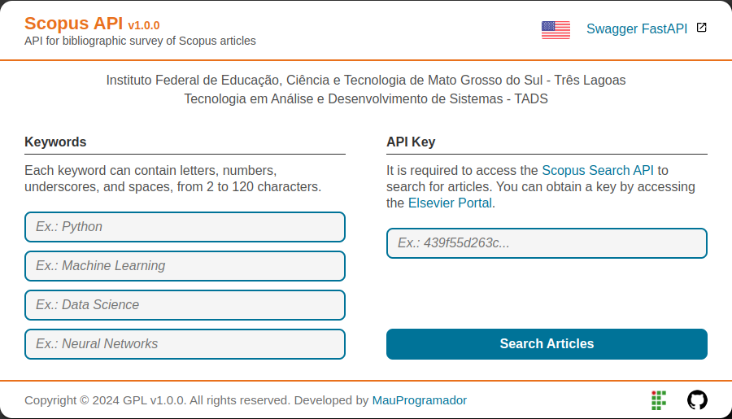
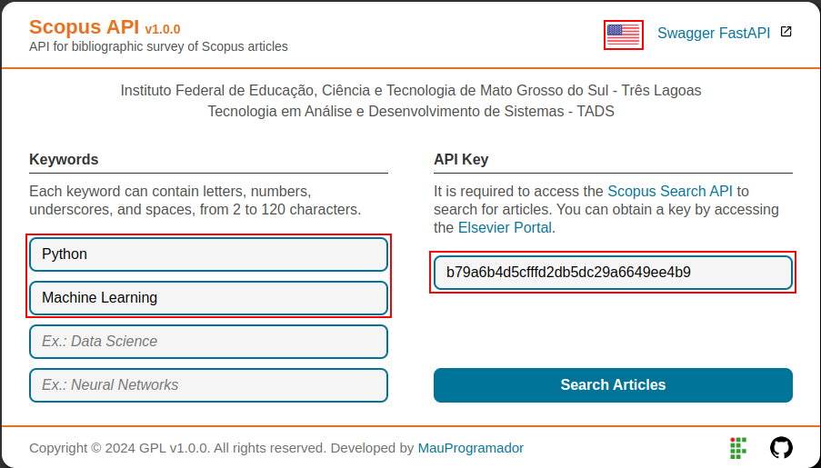
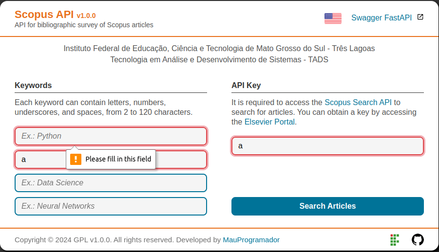

# Getting Started

## Clone

First you need to clone the project from the GitHub repository: <https://github.com/mauprogramador/scopus-searcher-api>{:target="_blank"}

On the Bash terminal:

```bash
git clone https://github.com/mauprogramador/scopus-searcher-api.git
```

On Vs Code:

> `Ctrl` + `Shift` + `P` > `Git: Clone` > <https://github.com/mauprogramador/scopus-searcher-api.git>{:target="_blank"}

## Run

With Python3:

```bash
# Run the App locally
$ make run
```

With Docker:

```bash
# Run the App in Docker Container
$ make docker
```

---

## Interactive Swagger

Once you start the application you can access the [Swagger UI](https://github.com/swagger-api/swagger-ui){:target="_blank"} by: <http://127.0.0.1:8000>{:target="_blank"}


Select the first Endpoint (**GET /scopus-searcher/api/search-articles**) and click on **Try it out**.

- Enter your `Api Key` and `Keywords`.
- The `Keywords` must be separated by a comma.
- It is mandatory to fill in the `Api Key` field and at least two `keywords`.
- The `X-Access-Token` header will be setted automatically, you **must not** change it.
- Click on the **Execute** button.


If any article is successfully found, it will return a [CSV file](https://pt.wikipedia.org/wiki/Comma-separated_values){:target="_blank"} containing all the search information. You can click on the **Download** button to download the file.


If no article is found, a message will return informing what went wrong. You should first read and analyze the message and try to understand what caused the error before trying again.


## Web Application

Once you start the application you can access the Web Application by: <http://127.0.0.1:8000/scopus-searcher/api>{:target="_blank"}



On the web page, click on the fields and enter your data, making sure they are correct.

- Select your preferred language by clicking on the **Flag** symbol (Support for `en-us` and `pt-br`).
- Enter your `Api Key` and `Keywords` in the respective fields.
- Enter one `Keyword` for each field.
- It is mandatory to fill in the `Api key` field and at least two `Keywords` fields.
- Click on the **Search Articles** button and wait for the search results.



If any article is successfully found, a message will return informing you of success and [CSV file](https://pt.wikipedia.org/wiki/Comma-separated_values){:target="_blank"} containing all the search information will be automatically downloaded.


If no article is found, a message will return informing what went wrong. You should first read and analyze the message and try to understand what caused the error before trying again.


You can also check the request response in the browser's [DevTools](https://developer.chrome.com/docs/devtools?hl=pt-br){:target="_blank"} inspect.


All fields on the web page are configured to verify that the information in each respective field is correct, so you must be aware of the rules and conditions regarding the `Api Key` and the `Keywords` provided in the [requirements section](./requirements.md).

As soon as you start typing in a field, it will automatically give you feedback, so stay tuned:

- Remember that it is mandatory to fill in the `Api Key` field and at least two `Keywords` fields.
- The red color will circe the field and a message will be shown if the data is incorrect.
- The green color will circle the field if the data is correct.


