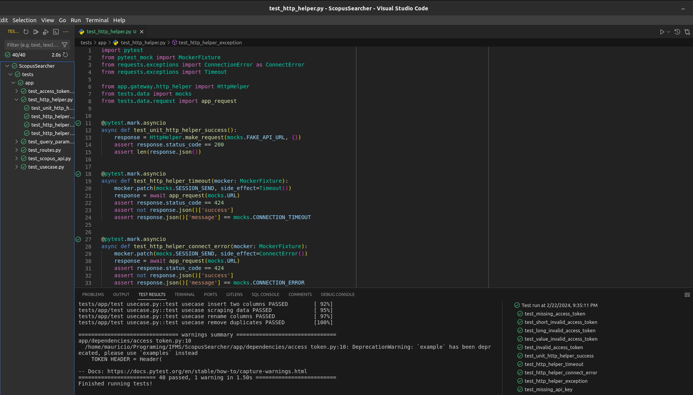
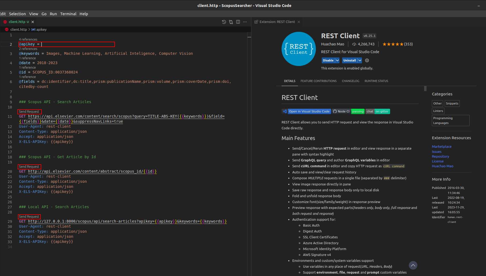

# Testing

## Automated tests

You can [configure](./environment.md#tests-environment) and use the [Vs Code to test](https://code.visualstudio.com/docs/python/testing){:target="_blank"} all the scripts with [Pytest](https://docs.pytest.org/en/8.0.x/){:target="_blank"} and [Coverage](https://coverage.readthedocs.io/en/7.4.3/){:target="_blank"}:

```bash
# Run Pytest in Venv
(.venv) $ make test

# Run Pytest in Docker
$ make test-docker

# Run Coverage in Venv
(.venv) $ make coverage

# Run Coverage in Docker
$ make coverage-docker
```



## Request Tests

You can install the [Rest Client Vs Code Extension](https://github.com/Huachao/vscode-restclient){:target="_blank"} to configure and send requests to test the [Scopus Search API](https://dev.elsevier.com/documentation/SCOPUSSearchAPI.wadl){:target="_blank"}. Access the `tests/client.http` file, insert your `Api Key` and send the requests:


