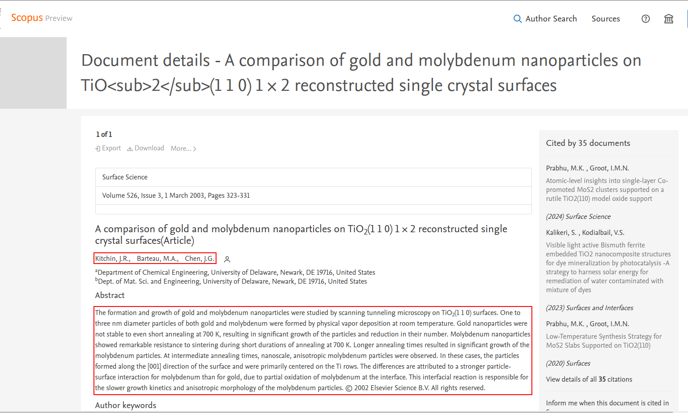

# Web Scraping

After obtaining the data for each article from the [Scopus Search API](https://dev.elsevier.com/documentation/SCOPUSSearchAPI.wadl){:target="\_blank"}, the next step is to obtain information about the `authors` and the `abstract` of each article, as this is not normally provided by the **API** itself. To do this, we need to make a request using the `Scopus ID` that we get from the **API** to get the article [preview page in Scopus](https://www.scopus.com/home.uri?zone=header&origin=recordpage){:target="\_blank"}, the request will retrieve this page as an HTML template, which we will submit to the [BeautifulSoup](https://beautiful-soup-4.readthedocs.io/en/latest/){:target="\_blank"} library for scraping and recovery, to later format this information we need.



## Article URL

This is the base URL of the article preview page.

```text
https://www.scopus.com/inward/record.uri?partnerID=HzOxMe3b&scp=...&origin=inward
```

This is an example URL with `0037368024` as the Scopus article Id.

```text
https://www.scopus.com/inward/record.uri?partnerID=HzOxMe3b&scp=0037368024&origin=inward
```

!!! note

    [Click here](https://www.scopus.com/inward/record.uri?partnerID=HzOxMe3b&scp=0037368024&origin=inward){:target="\_blank"} to see an example of an article preview page.

## Article Page Headers

Since the article page is served to [Elsevier](https://www.elsevier.com/pt-br){:target="\_blank"} by [Cloudflare](https://www.cloudflare.com/pt-br/){:target="\_blank"}, we need to send the appropriate headers in the request to not get a [forbidden](https://developer.mozilla.org/pt-BR/docs/Web/HTTP/Status/403){:target="\_blank"}, denied permission, or some [other error](https://developer.mozilla.org/en-US/docs/Web/HTTP/Status#client_error_responses){:target="\_blank"}.

```json
"Cache-Control": "no-cache",
"Pragma": "no-cache",
"Referer": "https://www.scopus.com/",
"Connection": "keep-alive",
"Content-Type": "text/plain",
"Origin": "https://www.scopus.com",
"Accept-Encoding": "gzip, deflate, br",
"Accept-Charset": "ISO-8859-1,utf-8;q=0.7,*;q=0.3",
"Accept-Language": "pt-BR,pt;q=0.9,en-US;q=0.8,en;q=0.7",
"Accept": "text/html,application/xhtml+xml,application/xml;q=0.9,image/avif,image/webp,image/apng,*/*;q=0.8,application/signed-exchange;v=b3;q=0.7",
"User-Agent": "Mozilla/5.0 (X11; Linux x86_64) AppleWebKit/537.36 (KHTML, like Gecko) Chrome/121.0.0.0 Safari/537.36"
```
