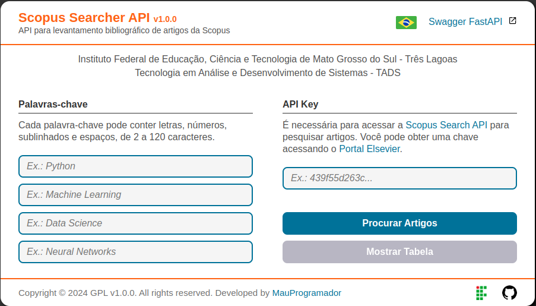
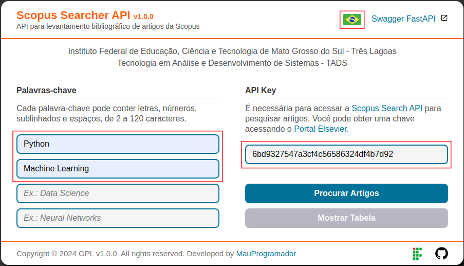
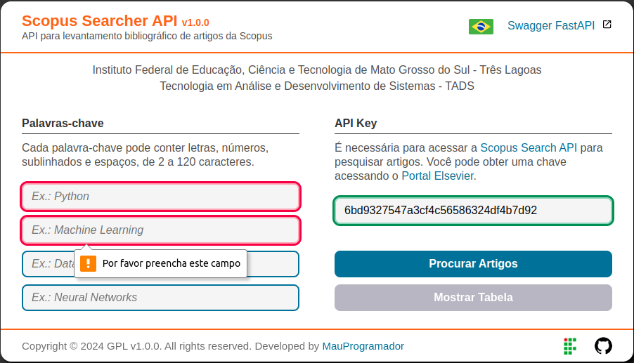
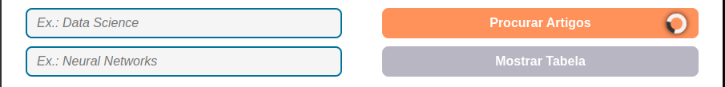
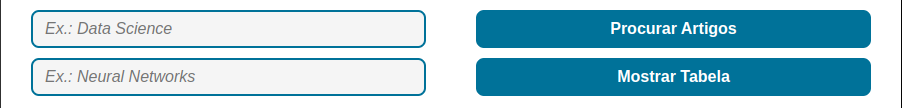

# Primeiros Passos

## Clone

Primeiro você precisa clonar o projeto do repositório no GitHub:
<https://github.com/mauprogramador/scopus-searcher-api>{:target="\_blank"}

No terminal Bash usando o [Git](https://git-scm.com/){:target="\_blank"}:

```zsh
git clone https://github.com/mauprogramador/scopus-searcher-api.git
```

No Vs Code usando a [Extensão do Git](https://git-scm.com/book/en/v2/Appendix-A%3A-Git-in-Other-Environments-Git-in-Visual-Studio-Code){:target="\_blank"}:

- Abra a **Paleta de Comandos** e pressione `Ctrl` + `Shift` + `P` ou `F1`
- Selecione o comando `Git: Clone` e clique nele
- Cole a URL do repositório: <https://github.com/mauprogramador/scopus-searcher-api.git>{:target="\_blank"}
- Pressione `Enter` ou clique em `Clone from URL` e selecione um diretório

!!! note

    Dê uma olhada na [Documentação do Controle de Versão](https://code.visualstudio.com/docs/sourcecontrol/overview){:target="\_blank"}.

## Execute

Com Python3:

!!! note

    Primeiro você precisa criar o [Ambiente](./environment.md#ambiente-de-desenvolvimento).

```zsh
# Execute a aplicação localmente
make run
```

Com Docker:

```zsh
# Execute a aplicação no Container do Docker
make docker
```

---

## Swagger interativo

Depois de iniciar a aplicação, você pode acessar o [Swagger UI](https://github.com/swagger-api/swagger-ui){:target="\_blank"} clicando em: <http://127.0.0.1:8000>{:target="\_blank"}


Selecione o **Endpoint da API** `/search-articles` e clique no botão **Try it out**.

- Insira sua `Api Key` e `Keywords`.
- As `Palavras-chave` devem ser separadas por vírgula.
- É obrigatório o preenchimento do campo da `Api Key` e pelo menos duas `Palavras-chave`.
- O cabeçalho `X-Access-Token` será definido automaticamente, você **não deve** alterá-lo.
- Clique no botão **Execute**.


Se algum artigo for encontrado com sucesso, irá retornar um [arquivo CSV](https://pt.wikipedia.org/wiki/Comma-separated_values){:target="\_blank"} contendo todas as informações da pesquisa. Você pode clicar no botão **Download** para baixar o arquivo.


Caso nenhum artigo seja encontrado, uma mensagem retornará informando o que houve de errado. Você deve primeiro ler e analisar a mensagem e tentar entender o que causou o erro antes de tentar novamente.


## Aplicação Web

Depois de iniciar a aplicação, você pode acessar a aplicação Web clicando em: <http://127.0.0.1:8000/scopus-searcher/api>{:target="\_blank"}



Na página web, clique nos campos e insira seus dados, certificando-se de que estão corretos.

- Selecione o idioma de sua preferência clicando no símbolo da **Bandeira** (Suporte para `en-us` e `pt-br`).
- Insira sua `Api Key` e `Palavras-chave` nos respectivos campos.
- Insira uma `Palavra-chave` para cada campo..
- É obrigatório o preenchimento do campo da `Api Key` e de pelo menos dois campos das `Palavras-chave`.
- Clique no botão **Procurar Artigos** e aguarde os resultados da pesquisa.



Todos os campos da página web estão configurados para verificar se as informações de cada respectivo campo estão corretas, portanto você deve estar atento às regras e condições relativas à `Api Key` e às `Palavras-chave` fornecidas na [seção de requisitos](./requirements.md).

Assim que você começar a digitar em um campo, ele lhe dará um feedback automaticamente, então fique atento:

- Lembre-se que é obrigatório o preenchimento do campo da `Api Key` e de pelo menos dois campos das `Palavras-chave`.
- A cor vermelha circulará o campo e uma mensagem será mostrada caso os dados estejam incorretos.
- A cor verde circulará o campo se os dados estiverem corretos.



Se algum artigo for encontrado com sucesso, uma mensagem retornará informando sobre o sucesso e o [arquivo CSV](https://pt.wikipedia.org/wiki/Comma-separated_values){:target="\_blank"} contendo todas as informações da pesquisa será baixado automaticamente.


Caso nenhum artigo seja encontrado, uma mensagem retornará informando o que houve de errado. Você deve primeiro ler e analisar a mensagem e tentar entender o que causou o erro antes de tentar novamente.


Você também pode verificar no inspecionar [DevTools](https://developer.chrome.com/docs/devtools?hl=pt-br){:target="\_blank"} do navegador a resposta da requisição.


## Tabela CSV

Após o término **com sucesso** do processamento da busca, além do download do [arquivo CSV](https://pt.wikipedia.org/wiki/Comma-separated_values){:target="\_blank"}, o botão **Mostrar Tabela** também será liberado, e ao clicar nele você será redirecionado para uma nova página na qual uma tabela exibirá uma visualização prévia de todos os dados dos artigos encontrados.




### Exemplo de Busca

A tabela abaixo exemplifica os resultados de uma busca. Usando **Python** e **Machine Learning** como `Palavras-chave`, um total de **6786** artigos foi retornado da [Scopus Search API](https://dev.elsevier.com/documentation/SCOPUSSearchAPI.wadl){:target="\_blank"}. Para evitar um longo processamento, nós [reduzimos](./scopus-search-api.md#reduzindo-a-contagem) o total para apenas **14**, não houve [perda por similaridade](./data-survey.md#filtragem) e demorou cerca de **34.012,64ms**.


!!! note

    [Clique aqui](../example.csv){:download="example.csv"} para baixar o arquivo CSV do exemplo de pesquisa acima.
