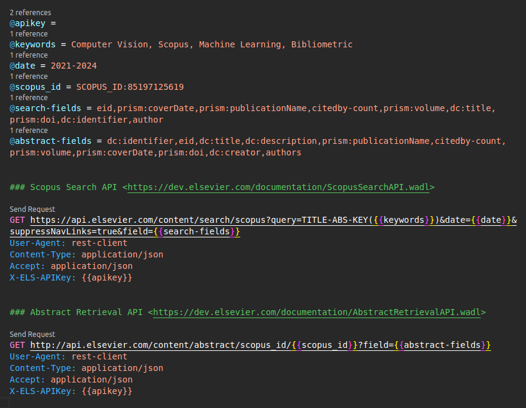

# Testes

## Testes automatizados

**:material-test-tube: Unitários:** testa os componentes individuais (cada unidade) isoladamente.<br>

**:material-test-tube: Integração:** testa a entidade combinada de diferentes unidades, módulos ou componentes.<br>

**:material-shield-check: Cobertura:** cobertura de teste de **99%**.

```text
.
├── tests
│   ├── helpers/
│   ├── integration/
│   |   ├── adapters/
|   |   |   ├── gateway/
|   |   |   └── helpers/
│   |   ├── core/
|   |   |   └── usecases/
│   |   └── framework/
|   |       ├── dependencies/
|   |       ├── exceptions/
|   |       ├── fastapi/
|   |       └── middleware/
│   ├── mocks/
│   └── unitary/
│       ├── adapters/
|       |   ├── gateway/
|       |   ├── helpers/
|       |   └── presenters/
│       ├── core/
|       |   ├── data/
|       |   ├── domain/
|       |   └── usecases/
│       └── framework/
|           ├── dependencies/
|           └── exceptions/
```

Você pode configurar e usar o [VsCode para testar](https://code.visualstudio.com/docs/python/testing){:target="\_blank"} todos os scripts com [Pytest](https://docs.pytest.org/en/8.0.x/){:target="\_blank"} e o [Coverage](https://coverage.readthedocs.io/en/7.4.3/){:target="\_blank"}:

```json title="launch.json" linenums="1"
{
  "version": "0.2.0",
  "configurations": [
    {
      "name": "Python Debugger: FastAPI",
      "type": "debugpy",
      "request": "launch",
      "module": "app.framework.fastapi.main",
      "pythonArgs": ["-Xfrozen_modules=off"],
      "jinja": true,
      "console": "integratedTerminal",
    }
  ]
}
```

=== "Localmente com Poetry"

    ```zsh
    # Configurar o Venv
    make setup

    # Ativar o Venv
    source .venv/bin/activate

    # Instalar as dependências de teste com Poetry
    (.venv) poetry install --only test

    # Execute o Pytest no Venv
    (.venv) make test

    # Execute o Coverage no Venv
    (.venv) make coverage
    ```

=== "Localmente com Pip"

    ```zsh
    # Configurar o Venv
    make setup

    # Ativar o Venv
    source .venv/bin/activate

    # Instalar as dependências de teste com Pip
    (.venv) pip3 install -r requirements/requirements-test.txt

    # Execute o Pytest no Venv
    (.venv) make test

    # Execute o Coverage no Venv
    (.venv) make coverage
    ```

=== "Docker"

    ```zsh
    # Execute a aplicação no Contêiner Docker
    make docker

    # Execute o Pytest no Docker
    make test-docker

    # Execute o Coverage no Docker
    make coverage-docker
    ```


## Testes de Requisição das APIs da Scopus

Instale a [Extensão REST Client do VsCode](https://github.com/Huachao/vscode-restclient){:target="\_blank"} para configurar e enviar requisições para testar as **APIs da Scopus**.


**1.** Acesse o arquivo `client.http`.<br>
**2.** Insira sua `Chave da API` em `@apikey =`.<br>
**3.** Clique em `Send Request`.


